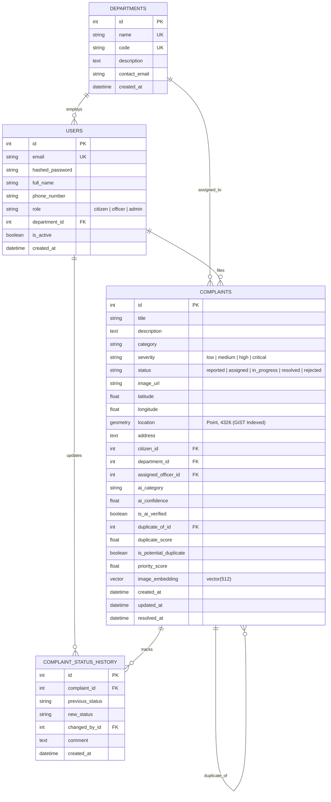

# Nagar Drishti Database ER Diagram & Schema

```mermaid
erDiagram
    DEPARTMENTS ||--o{ USERS : employs
    DEPARTMENTS ||--o{ COMPLAINTS : assigned_to
    USERS ||--o{ COMPLAINTS : files
    USERS ||--o{ COMPLAINT_STATUS_HISTORY : updates
    COMPLAINTS ||--o{ COMPLAINT_STATUS_HISTORY : tracks
    COMPLAINTS ||--o{ COMPLAINTS : duplicate_of

    DEPARTMENTS {
        int id PK
        string name UK
        string code UK
        text description
        string contact_email
        datetime created_at
    }

    USERS {
        int id PK
        string email UK
        string hashed_password
        string full_name
        string phone_number
        string role "citizen | officer | admin"
        int department_id FK
        boolean is_active
        datetime created_at
    }

    COMPLAINTS {
        int id PK
        string title
        text description
        string category
        string severity "low | medium | high | critical"
        string status "reported | assigned | in_progress | resolved | rejected"
        string image_url
        float latitude
        float longitude
        geometry location "Point, 4326 (GiST Indexed)"
        text address
        int citizen_id FK
        int department_id FK
        int assigned_officer_id FK
        string ai_category
        float ai_confidence
        boolean is_ai_verified
        int duplicate_of_id FK
        float duplicate_score
        boolean is_potential_duplicate
        float priority_score
        vector image_embedding "vector(512)"
        datetime created_at
        datetime updated_at
        datetime resolved_at
    }

    COMPLAINT_STATUS_HISTORY {
        int id PK
        int complaint_id FK
        string previous_status
        string new_status
        int changed_by_id FK
        text comment
        datetime created_at
    }
```
