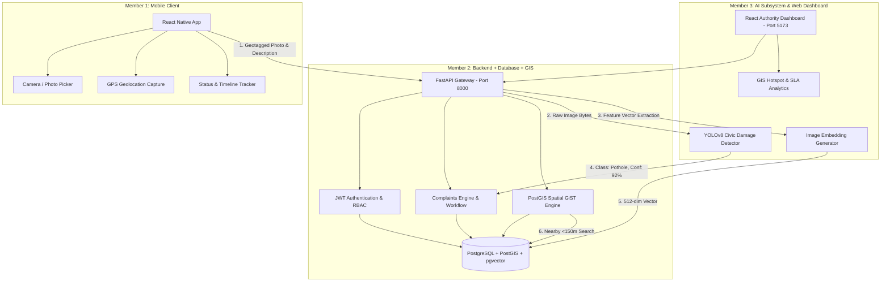

# Nagar Drishti System Architecture & Dataflow

Nagar Drishti is built on a distributed civic micro-monorepo designed for high throughput, mobile vision inference, geospatial indexing, and municipal workflow tracking.

---

## 🏛️ High-Level System Architecture

---

## 📐 Multimodal Duplicate Detection Engine

When a complaint is received with coordinates $(lat_1, lon_1)$ and image $I_1$:

1. **Spatial Filtering via PostGIS**:
   Find all complaints $C_i$ where:
   $$\text{ST\_DWithin}(Location_1, Location_i, 150) \quad \text{AND} \quad \text{Category}_1 = \text{Category}_i$$

2. **Spatial Similarity ($S_{geo}$)**:
   $$S_{geo} = \max\left(0, 1.0 - \frac{\text{HaversineDistance}(C_1, C_i)}{150}\right)$$

3. **Visual Cosine Similarity ($S_{img}$)**:
   Using pgvector cosine distance ($\Leftrightarrow$):
   $$S_{img} = \frac{\vec{v}_1 \cdot \vec{v}_i}{\|\vec{v}_1\| \|\vec{v}_i\|}$$

4. **Combined Duplicate Score**:
   $$S_{dup} = (0.5 \times S_{img}) + (0.5 \times S_{geo})$$

5. **Decision Boundary**:
   - If $S_{dup} \ge 0.80$: Marked as `is_potential_duplicate = true`, linked to original complaint via `duplicate_of_id`.
   - **Audit Guarantee**: Both complaints remain distinct records in database so citizens can track their individual submissions without data loss.

---

## ⚖️ Prioritization Algorithm

$$\text{Priority Score} = (\text{Severity} \times 0.5) + (\text{Frequency} \times 0.3) + (\text{Location Risk} \times 0.2)$$

- **Score 80–100**: Critical (Immediate dispatch within 12 hours)
- **Score 60–79**: High (Dispatch within 24 hours)
- **Score 40–59**: Medium (48 hours resolution SLA)
- **Score < 40**: Low (Standard maintenance cycle)
